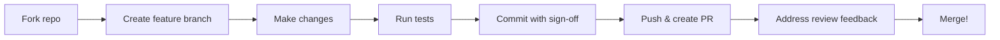

# Contributing to PoCP AI Commons

> **Contribution is the proof.**

First off, thank you for considering contributing to PoCP AI Commons. Every contribution — code, docs, ideas, tests, reviews — moves the project forward.

## Table of Contents

- [Code of Conduct](#code-of-conduct)
- [Quick Start](#quick-start)
- [Project Structure](#project-structure)
- [Development Setup](#development-setup)
- [Testing](#testing)
- [Contribution Workflow](#contribution-workflow)
- [Commit Guidelines](#commit-guidelines)
- [Pull Request Process](#pull-request-process)
- [Issue Reporting](#issue-reporting)

## Code of Conduct

Be respectful. Assume good faith. Disagree constructively.

This is a contribution-based protocol experiment — treat every participant (human or AI) as a peer.

## Quick Start

```bash
git clone https://github.com/PoCP-Labs/pocp-ai-commons.git
cd pocp-ai-commons

# Option A: Docker (recommended for first time)
docker compose up --build
# Frontend: http://localhost:3000
# API:      http://localhost:8000/docs

# Option B: Manual
cd backend && python3 -m venv venv && source venv/bin/activate
pip install -r requirements.txt
uvicorn main:app --reload --port 8000

# In another terminal:
cd frontend && npm install && npm run dev
```

## Project Structure

```
backend/
├── models/          # SQLAlchemy ORM models
│   ├── entity.py    # Human, Agent, Skill, Organization entities
│   ├── contribution.py  # Contributions, participants, reviews
│   ├── wallet.py    # Wallets, credit transactions, reputation
│   ├── invocation.py    # AI invocation traces
│   ├── ledger.py    # Immutable event log
│   ├── task.py      # Tasks
│   ├── account.py   # Auth accounts
│   └── ...
├── routers/         # FastAPI route handlers
│   ├── api.py       # Main public API endpoints
│   ├── auth.py      # Registration, login, profile
│   └── protected.py # Authenticated-only endpoints
├── services/        # Business logic
│   ├── contribution.py  # Verification, approval, rewards
│   ├── ai.py        # AI model client (DeepSeek / OpenAI / Ollama)
│   ├── graph.py     # Contribution graph builder
│   └── ...
├── schemas/         # Pydantic request/response models
├── tests/           # pytest test suite
├── scripts/
│   └── smoke_test.py    # Full E2E loop test against running server
├── main.py          # FastAPI application entry point
└── database.py      # SQLAlchemy engine + session

frontend/
├── src/
│   ├── auth/        # Auth context, login/register, API client
│   ├── App.jsx      # Main app with tab navigation
│   ├── AIChat.jsx   # AI Chat component
│   ├── ContributionGraph.jsx  # Entity + process graph
│   ├── SkillDetail.jsx        # Skill detail view
│   └── SubmitFlow.jsx         # Contribution submission form
├── index.html
└── vite.config.js

docs/
├── PROTOCOL.md      # Protocol conceptual notes
├── SCHEMA.md        # Database schema details
├── VISION.md        # Long-term vision
├── DEPLOY.md        # Deployment & env configuration
├── AUTHORSHIP.md    # Contribution ownership
└── skills/          # Skill specifications

CONTRIBUTORS.md      # Contributor registry
```

## Development Setup

### Prerequisites

- **Python** 3.12+
- **Node.js** 22+
- **pnpm** or **npm**
- **Docker** & **Docker Compose** (optional, for containerized dev)

### Backend Setup

```bash
cd backend
python3 -m venv venv
source venv/bin/activate
pip install -r requirements.txt

# Run with auto-reload
uvicorn main:app --reload --port 8000
```

The server seeds demo data on first startup (entities, tasks, skills, agents, auth accounts).

Seeded demo accounts (see `AUTH_GUIDE.md` for details):
- `alice@example.com` / `secret123` — regular contributor
- `bob@example.com` / `secret123` — reviewer (superuser)
- `charlie@agent.com` / `charlie123` — agent entity

### AI Model Configuration (Optional)

Set `AI_API_KEY` to enable real AI replies instead of simulation:

```bash
# DeepSeek (default, free tier available)
export AI_API_KEY=sk-your-deepseek-key

# or OpenAI
export AI_API_BASE=https://api.openai.com/v1
export AI_MODEL=gpt-4o

# or local Ollama
export AI_API_BASE=http://localhost:11434/v1
export AI_MODEL=qwen2.5
```

See [docs/DEPLOY.md](docs/DEPLOY.md) for more options.

### Frontend Setup

```bash
cd frontend
npm install
npm run dev  # → http://localhost:3000
```

### Docker Setup

```bash
# Start everything
docker compose up --build

# Run only backend
docker compose up backend

# Run tests in container
docker compose exec backend pytest
```

## Testing

### Backend Tests

```bash
cd backend
source venv/bin/activate

# Run all tests
pytest -v

# Run specific test file
pytest tests/test_auth.py -v

# Run with coverage
pip install pytest-cov
pytest --cov=. --cov-report=term-missing
```

### Smoke Test (E2E)

Requires the backend to be running:

```bash
# Start backend first
uvicorn main:app --port 8000 &

# Run smoke test
python backend/scripts/smoke_test.py
```

### Test Conventions

- Tests use an **in-memory SQLite database** (see `test_auth.py` for setup pattern)
- Each test file creates its own `TestClient` and database
- Tests should be **isolated** — no shared state between test functions
- Use `pytest.fixture` for reusable setup
- Name test functions descriptively: `test_xxx_when_yyy_should_zzz`

## Contribution Workflow



### 1. Fork & Branch

```bash
# Fork on GitHub, then:
git clone https://github.com/YOUR_USERNAME/pocp-ai-commons.git
git checkout -b feat/my-feature

# Branch naming:
#   feat/    — new feature
#   fix/     — bug fix
#   test/    — test additions
#   docs/    — documentation
#   refactor/ — code restructuring
```

### 2. Make & Test

```bash
# Backend: run tests before committing
cd backend && pytest -v

# Frontend: verify build succeeds
cd frontend && npm run build
```

### 3. Commit & Sign

```bash
git add .
git commit -s -m "feat: clear description of what and why"
```

The `-s` flag adds a `Signed-off-by` line. This is a lightweight certification that you wrote the code or have the right to submit it.

### 4. Push & PR

Push to your fork, then open a PR against `main` at `PoCP-Labs/pocp-ai-commons`.

Your PR description should include:
- **What** — what does this change?
- **Why** — why is this change needed?
- **How** — how was it implemented?
- **Testing** — what tests were added or verified?
- **Closes #N** — link to any related issues

## Commit Guidelines

We use **Conventional Commits**:

```
<type>(<scope>): <description>

[optional body]

Signed-off-by: Your Name <your.email@example.com>
```

### Types

| Type     | Usage                                   |
|----------|-----------------------------------------|
| `feat`   | A new feature                           |
| `fix`    | A bug fix                               |
| `docs`   | Documentation-only changes              |
| `test`   | Adding or fixing tests                  |
| `refactor` | Code restructuring, no behavior change |
| `chore`  | Build, CI, dependencies                 |

### Scope Examples

`feat(backend)`, `fix(frontend)`, `docs(readme)`, `test(ai-verifier)`

## Pull Request Process

1. **Title**: `<type>(<scope>): <description>` — same as commit format
2. **Description**: Template with What/Why/How/Testing sections
3. **CI**: All tests must pass
4. **Review**: At least one maintainer approval required
5. **Merge**: Squash or rebase — maintainer's discretion

### What Maintainers Look For

- **Does it work?** — tests pass, behavior correct
- **Is it clear?** — code readable, naming obvious
- **Is it minimal?** — smallest possible change for the goal
- **Is it documented?** — new features need docs, changed behavior needs comments

## Issue Reporting

- **Bug reports**: Include steps to reproduce, expected vs actual behavior, environment details
- **Feature requests**: Describe the problem you're solving, not just the solution
- **Questions**: Open a discussion or ask in the community

Labels:
- `bug` — something is broken
- `enhancement` — new feature or improvement
- `documentation` — docs issues
- `good first issue` — easy entry point for new contributors

## Recognition

All contributors are listed in [CONTRIBUTORS.md](CONTRIBUTORS.md).

After your first PR is merged, add yourself! Contributions aren't measured by line count — a thoughtful review, well-written issue, or careful refactor is just as valuable.

---

**Thank you for being part of PoCP AI Commons.** 🌟
