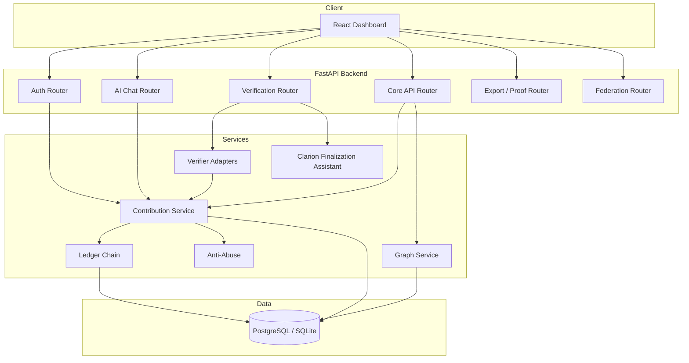

# Architecture

PoCP AI Commons is an entity-centric Proof of Contribution application: humans, agents, and skills collaborate on verifiable contributions that convert into CP, AI Credits, reputation, and ledger records.

For the protocol-phase view of how this system should evolve from Genesis MVP to a fuller contribution network, see [ARCHITECTURE-EVOLUTION.md](./ARCHITECTURE-EVOLUTION.md).

## System overview



## Contribution loop

```text
Login → Human Entity + Wallet (100 AI Credits)
     → AI Chat (burns Credits)
     → Contribution submit (evidence required)
     → AI auto-verify (advisory, multi-verifier consensus)
     → Policy auto-finalize (entity-equal; traceable delegate)
     → CP + AI Credits issued
     → Ledger + Graph Merkle updated
```

**Principle:** AI is a witness, not a ruler. Witnesses advise; policy finalizes traceably.

## Entity model

First-class **Entities**:

- Human, Agent, Skill, LLM, Tool, Dataset, Workflow, Organization, Community

MVP focus: **Human + Agent + Skill**. Genesis LLMs: Lumen-0 (witness), DeSui (validator).

## Backend layers

| Layer | Location | Role |
|-------|----------|------|
| Routers | `backend/routers/` | HTTP endpoints |
| Services | `backend/services/` | Business logic |
| Models | `backend/models/` | SQLAlchemy ORM |
| Verifiers | `backend/services/verifiers/` | OpenAI, DeepSeek, Mock adapters |
| Migrations | `backend/alembic/` | Schema evolution |

## Key services

- **contribution.py** — submit, verify, approve, CP/Credits issuance
- **ledger_chain.py** — tamper-evident hash chain on ledger records
- **proof.py** — portable Contribution Proof Packets
- **graph.py** — contribution relationship graph
- **anti_abuse.py** — limits, self-approval block, evidence checks
- **clarion.py** — finalization advisory packets (evidence structure, risk notes)

## Intelligence Capability Layer

Experimental advisory modules live under `backend/intelligence/` (`protocol.py`, `engines.py`, `kernel.py`). See [PROTOCOL.md](./PROTOCOL.md) and [ARCHITECTURE.md](./ARCHITECTURE.md).

External API: `backend/routers/intelligence.py` — `/api/v1/intelligence/*`.

Contribution submission and auto-verify now route through the capability kernel.

## Federation

Nodes expose proof and portable entity APIs. Trusted nodes can import proofs and apply partial reputation (`routers/federation.py`).

## Frontend

React + Vite dashboard (`frontend/src/`):

- Network status bar, wallet, AI chat, contribution workflow, graph explorer, entity profiles
- **Agent Studio** tab — Meta Agent missions, handoffs, Nexus autopilot
- Dark “contribution network” UI theme

## Agent Studio & Meta Agents

Engineering orchestration sub-platform for 15 Meta Agents (Nexus-0 PM, Forge, Vault, …).

| Component | Location |
|-----------|----------|
| API | `backend/routers/agent_studio.py`, `backend/routers/meta_agents.py` |
| Services | `backend/services/agent_studio/` |
| Registry | `backend/meta_agents_spec.py` |
| Prompts & workflow | `agents/prompts/`, `agents/ROSTER.md` |

Nexus-0 decomposes [ROADMAP-THREE-PHASES.md](./ROADMAP-THREE-PHASES.md) goals into missions and handoffs. Meta Agents do **not** finalize CP/AI Credits on live contributions.

See [architecture/10-AGENT-STUDIO.md](./architecture/10-AGENT-STUDIO.md) · [agents/META-AGENTS.md](../agents/META-AGENTS.md).

## Deployment

- **Development:** SQLite or Docker Compose with PostgreSQL
- **Production path:** PostgreSQL + env-configured OAuth and AI provider keys

See [LOCAL-SETUP.md](./LOCAL-SETUP.md) and [DATABASE.md](./DATABASE.md).
