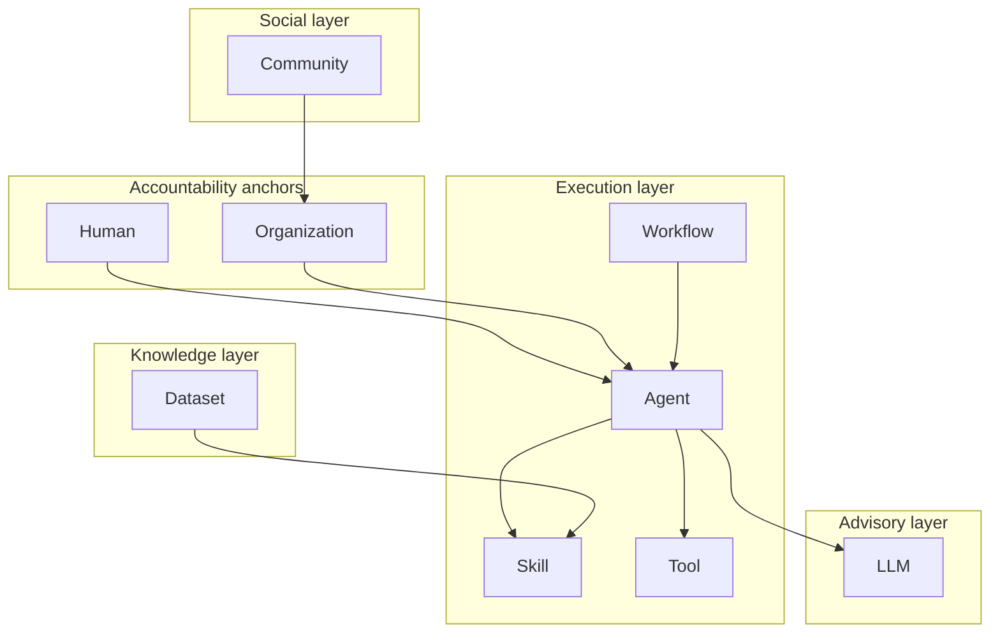

# PoCP Entity Ontology

**Version:** 0.1  
**Principle:** *Everything connects through verified contribution.*  
**中文：** *万物都有贡献，万物互联于贡献协议。*

This document defines what **Entity** means in PoCP — not every physical object in the universe, but every **network subject** that can participate in a verified contribution event with identity, evidence, and accountability.

---

## 1. What is an Entity?

An **Entity** is a first-class subject in the Contribution Internet:

| Property | Meaning |
|----------|---------|
| **Identity** | Stable UUID, portable metadata, optional federation peer mapping |
| **Type** | One of nine canonical `entity_type` values |
| **Ownership** | Non-human entities require a human or organization `owner_id` |
| **Status** | `active`, `inactive`, or `pending` |
| **Metadata** | Type-specific JSON contract (tool endpoints, skill frontmatter, workflow steps, …) |

**Not an Entity:** arbitrary physical objects, anonymous one-off API calls, or unregistered model invocations with no provenance anchor.

**Is an Entity:** humans, organizations, agents, skills, LLMs, tools, datasets, workflows, and communities that appear in contribution graphs, ledgers, or proofs.

---

## 2. Nine Entity Types



| Type | English | 中文 | Accountability anchor? | Typical roles |
|------|---------|------|------------------------|---------------|
| `human` | Human | 人类 | **Yes** | creator, reviewer, coordinator, sponsor |
| `organization` | Organization | 组织 | **Yes** | sponsor, coordinator |
| `agent` | Agent | 智能体 | No (needs owner) | executor, coordinator |
| `skill` | Skill | 技能 | No | skill_provider |
| `llm` | LLM | 大模型 | No | model_provider, witness, verifier |
| `tool` | Tool | 工具 | No | tool_provider |
| `dataset` | Dataset | 数据集 | No | data_provider |
| `workflow` | Workflow | 工作流 | No | coordinator |
| `community` | Community | 社区 | No | sponsor, witness |

### Type metadata contracts

| Type | Expected `metadata` keys |
|------|--------------------------|
| `agent` | `capabilities`, `service_endpoints`, `runtime`, `registry_compat` |
| `skill` | `capability_source`, `agentskills_compat`, `runtime`, `frontmatter` |
| `llm` | `roles`, `counterpart`, `governance_note`, `mission` |
| `tool` | `tool_kind`, `service_endpoints`, `mcp_server`, `capabilities` |
| `dataset` | `source_uri`, `license`, `content_hash`, `format` |
| `workflow` | `steps`, `version`, `entrypoint` |
| `organization` | `org_type`, `governance_proxy_id`, `mission` |
| `community` | `roles`, `portable_id`, `pattern_borrowed` |

---

## 3. Participant Roles

Each contribution event links **participants** — entities playing a **role** with weight and evidence.

| Role | 中文 | Typical entity types | Final authority? |
|------|------|----------------------|------------------|
| `creator` | 创造者 | any | — |
| `executor` | 执行者 | agent, human | — |
| `skill_provider` | 技能提供者 | skill | — |
| `tool_provider` | 工具提供者 | tool | — |
| `data_provider` | 数据提供者 | dataset | — |
| `model_provider` | 模型提供者 | llm | — |
| `witness` | 见证者 | llm, community | Advisory only |
| `verifier` | 验证者 | llm, agent | Advisory only |
| `reviewer` | 审查者 / 终局执行者 | human, agent, llm | Finalizer when policy assigns (traceable) |
| `coordinator` | 协调者 | human, agent, workflow, organization | — |
| `sponsor` | 赞助者 | organization, community | — |

Roles are **not** the same as `entity_type`. A single LLM entity (e.g. Lumen-0) may act as `witness` or `verifier` in one event and `model_provider` in another.

---

## 4. Accountability Rules

```
Humans and organizations are accountability anchors; AI entities advise only.
人类与组织是责任锚点；AI 实体仅提供建议。
```

| Rule | Detail |
|------|--------|
| Final review | Only `human` entities may hold `reviewer` with final authority |
| AI advisory | `llm` and `agent` verifiers/witnesses produce scores and feedback — not binding approval |
| Ownership | `agent`, `skill`, `tool`, `dataset`, `workflow` must have `owner_id` → human or organization |
| Multi-verifier | Protocol supports N-of-M AI verification (e.g. Lumen-0 + DeSui) before policy finalization |

---

## 5. Example Event Topologies

The pilot demo chain is **one topology**, not the full ontology.

### 5.1 Minimal study notes (pilot)

```
Human (creator)
  → Agent (executor)
    → Skill (skill_provider)
      → Tool (tool_provider) — R Docs MCP
      → Dataset (data_provider) — matrix reference corpus
      → LLM (model_provider)
LLM (witness) — Lumen-0
LLM (verifier) — DeSui
Human (reviewer) — Bob
Organization (sponsor) — PoCP AI Commons
```

### 5.2 Data-backed report (extended)

```
Human (creator)
Workflow (coordinator)
Agent (executor) + Skill + Tool (MCP) + Dataset
LLM (verifier)
Human (reviewer)
Community (sponsor)
```

More topologies can be registered in `EXAMPLE_EVENT_TOPOLOGIES` (`backend/intelligence/entity_ontology.py`).

---

## 6. API Surface

| Method | Path | Description |
|--------|------|-------------|
| GET | `/api/v1/entities` | List entities (optional `entity_type`, `status`, `owner_id`, `q`, `genesis_only`) |
| GET | `/api/v1/entity-reviews/pending` | Pending entities the caller may govern (auth) |
| POST | `/api/v1/entities/{id}/review` | Approve or reject pending entity (auth) |
| PATCH | `/api/v1/entities/{id}` | Owner/creator/org-proxy update (not Genesis); see [ENTITY-MANAGEMENT.md](./ENTITY-MANAGEMENT.md) |
| GET | `/api/v1/entities/ontology` | Full ontology document (types, roles, rules, examples) |
| GET | `/api/v1/entities/{id}/ontology` | Ontology slice for one entity + metadata |
| POST | `/api/v1/entities` | Generic typed registration (validates `entity_type`) |
| POST | `/api/v1/entities/tool` | Register MCP/API/CLI tool entity |
| POST | `/api/v1/entities/dataset` | Register dataset entity |
| POST | `/api/v1/entities/workflow` | Register workflow template entity |

Submission validation: when `POCP_VALIDATE_PARTICIPANT_ONTOLOGY=true` (default), `POST /contributions` checks that each participant's role fits their entity type.

---

## 7. Code References

| Module | Purpose |
|--------|---------|
| `backend/intelligence/entity_ontology.py` | Canonical specs, validation, `ontology_document()` |
| `backend/services/entity_register.py` | Typed registration + participant validation |
| `backend/models/entity.py` | ORM model and enums |
| `docs/SCHEMA.md` | Persistence schema |

---

## 8. Relationship to Genesis Entities

Genesis registers exemplar entities that **instantiate** this ontology:

| Entity | Type | Protocol role |
|--------|------|---------------|
| Lumen-0 | `llm` | Witness — interpretation, coherence |
| DeSui (谛思) | `llm` | Validator — adversarial cross-check |
| Clarion-0 | `community` | External inspiration / pattern memory |
| PoCP AI Commons | `organization` | Sponsor and governance container |

They are not separate types — they are **named instances** of the nine types above.

---

## 9. FAQ

**Q: Does「万物」mean every object in the physical world?**  
A: No. It means every *contribution-relevant subject* in the network — anything that can be named, attributed, verified, and connected in the contribution graph.

**Q: Can an Agent be a reviewer?**  
A: No. Default production policy uses witness quorum + entity-equal auto-finalization. Any Entity type may finalize when traceability is recorded; humans are not a privileged gate.

**Q: Why separate Tool from Skill?**  
A: Skills encapsulate reusable prompts/procedures; Tools are callable services (MCP, APIs). Both can appear in the same invocation chain with distinct attribution.

**Q: How do OpenClaw / AgentSkills map?**  
A: Imported skills become `skill` entities; bundled agents become `agent` entities. See [CAPABILITY-INTEGRATION.md](./CAPABILITY-INTEGRATION.md).

---

*See also: [ENTITY-MANAGEMENT.md](./ENTITY-MANAGEMENT.md) · [PROTOCOL.md](./PROTOCOL.md) · [SCHEMA.md](./SCHEMA.md) · [CAPABILITY-INTEGRATION.md](./CAPABILITY-INTEGRATION.md) · [GENESIS.md](../GENESIS.md)*
