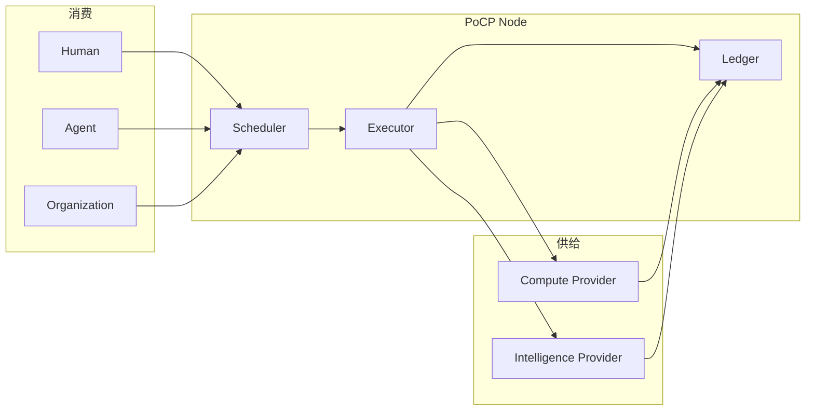

# 分布式神经互联网 — 完整设计方案 v1.0

**Canonical master plan:** architecture · participants · protocol · connectivity · economy · regulation · roadmap.

| 属性 | 值 |
|------|-----|
| 版本 | 1.0（2026-05-30） |
| 状态 | 设计 canonical；实现 α–δ + v0.3 已部分落地 |
| 读者 | 协议设计者、Pilot 运营、节点/Provider 集成者 |

**子规格索引：** [ENTITY-ONTOLOGY.md](./ENTITY-ONTOLOGY.md) · [NEURAL-INTERNET-SUPPLY-SPEC.md](./NEURAL-INTERNET-SUPPLY-SPEC.md) · [COMPUTE-METERING-SPEC.md](./COMPUTE-METERING-SPEC.md) · [ENTITY-MARKET-SPEC.md](./ENTITY-MARKET-SPEC.md) · [COMPUTE-BALANCE-SPEC.md](./COMPUTE-BALANCE-SPEC.md) · [DISTRIBUTED-TOKEN-RESEARCH.md](./DISTRIBUTED-TOKEN-RESEARCH.md) · [COMPUTE-FEDERATION-SPEC.md](./COMPUTE-FEDERATION-SPEC.md)

---

## 目录

1. [愿景与边界](#1-愿景与边界)
2. [神经隐喻 — 形式化映射](#2-神经隐喻--形式化映射)
3. [总体架构](#3-总体架构)
4. [参与方全景](#4-参与方全景)
5. [分布式算力子系统](#5-分布式算力子系统)
6. [分布式智力子系统](#6-分布式智力子系统)
7. [协议与记忆子系统](#7-协议与记忆子系统)
8. [经济与 PoCP Token](#8-经济与-pocp-token)
9. [联通子系统](#9-联通子系统)
10. [交易生命周期](#10-交易生命周期)
11. [不稳定与不均衡 — 调节机制](#11-不稳定与不均衡--调节机制)
12. [安全、防滥用与治理](#12-安全防滥用与治理)
13. [典型部署拓扑](#13-典型部署拓扑)
14. [数据模型与 API](#14-数据模型与-api)
15. [实现状态与路线图](#15-实现状态与路线图)
16. [Pilot 验收标准](#16-pilot-验收标准)
17. [设计原则与非目标](#17-设计原则与非目标)

---

## 1. 愿景与边界

### 1.1 一句话

> **PoCP 分布式神经互联网 = 可验证的贡献神经网络 + Entity 双边算力/智力市场 + 统一 PoCP Token + 可携带 Proof 记忆。**

不是中心化 GPU 云，不是 token-first 矿场，不是 Web2 积分。

### 1.2 要解决的问题

| 中心化痛点 | PoCP 答案 |
|------------|-----------|
| 算力寡头 | Entity 卖算力，PC/Org/peer 均可 provider |
| 智力 bundled 在 API | Skill/Agent/Human 分开供给与定价 |
| 账户锁定记忆 | Proof Packet + Ledger 可携带 |
| 订阅单向抽成 | 双边 Receipt，Provider 赚 Token |
| 投机空壳币 | 贡献优先；PoCP Token = 协议内使用权 |

### 1.3 边界（非目标）

- PoCP **不**运营中心化 GPU 农场  
- PoCP **不**在 Pilot 发行可场外炒作协议币（见 [NO-TOKEN-FIRST.md](../NO-TOKEN-FIRST.md)）  
- PoCP **不**保证 AWS 级 SLA；保证 **可验证、可 policy 调节**  
- PoCP **不**把 FLOPS 存进 Wallet；存 **Token、Artifact、容量权**

---

## 2. 神经隐喻 — 形式化映射

| 神经科学 | PoCP 原语 | 算力/智力 |
|----------|-----------|-----------|
| 神经元 | `Entity`（9 类型） | 身份 |
| 突触 | Graph 边 + `InvocationTrace` | 协作链 |
| 动作电位 | `Contribution Event` | 激活信号 |
| 局部场电位 | `Evidence` + hash | 局部证据 |
| 长期记忆 | `Ledger` + `Proof Packet` | 全局状态 |
| 前向传播 | Human→Agent→Skill→LLM | **智力编排 + 算力执行** |
| 突触可塑性 | `Reputation` + CP | 权重更新 |
| 抑制/兴奋 | mesh policy、quota | 调节 |
| 联邦脑区 | Federation peer | 跨节点 |

**关键区分：**

```text
算力层 = 执行（GPU/CPU 推理、嵌入、witness 推理）
智力层 = 编排（match、Skill、Agent、quorum、graph、Human 终审）
协议层 = 记住（Receipt、Trace、Ledger、Proof）
交易层 = 结算（PoCP Token、Pool）
```

---

## 3. 总体架构

### 3.1 四层栈

```text
┌─────────────────────────────────────────────────────────────────┐
│ L4 交易层（薄）                                                  │
│     Wallet · PoCP Token · ComputePool · CapacityReservation     │
│     anti_abuse 限额 · sponsor grant                             │
├─────────────────────────────────────────────────────────────────┤
│ L3 协议层                                                        │
│     Entity · Contribution · Evidence · Finalization             │
│     Proof Packet · InvocationTrace · Ledger · Federation         │
├─────────────────────────────────────────────────────────────────┤
│ L2 分布式智力层                                                  │
│     match · capability_execute · multi_verifier · graph         │
│     StudyAgent · Clarion · intelligence router                  │
├─────────────────────────────────────────────────────────────────┤
│ L1 分布式算力层                                                  │
│     ComputeProfile · scheduler · executor · Artifact            │
│     surplus recycle · LAN/federation discovery                  │
└─────────────────────────────────────────────────────────────────┘
```

**数据流口诀：**

```text
L2 决定「做什么、选谁」
L1 决定「在哪跑、跑完没」
L3 决定「记住什么、谁负责」
L4 决定「扣多少、给谁」
```

### 3.2 与贡献循环的关系

```text
Contribution（输入）
  → Verification（共识）
  → CP + PoCP Token mint（权利）
  → 消费算力/智力（市场）
  → Provider 赚 Token（市场）
  → 更多 Contribution（闭环）
  → Graph + Ledger 增长（记忆）
```

---

## 4. 参与方全景

### 4.1 算力供给方

| Entity | capability | 设备/Runtime | 挂牌 |
|--------|--------------|--------------|------|
| LLM | `llm_inference`, `witness` | Ollama/vLLM/OpenAI-compatible | `compute_profile` |
| Tool | `embeddings`, `mcp_host` | 服务/API | `compute_profile` |
| Organization | 组合池 | 机房多机 | profile + **ComputePool** |
| Community | peer witness | 节点 | federation |

**不要求 Ollama** — 任何 HTTP 可达、OpenAI 兼容或 ollama adapter 均可。

### 4.2 智力供给方

| Entity | 供给 | Receipt |
|--------|------|---------|
| Skill | 专项流程 | Trace + IntelReceipt |
| Agent | 编排 | Trace |
| LLM | witness 席位 | Compute + Intel |
| Human | 终审/审稿 | Review + CP |
| Workflow | 拓扑 | Trace |
| Dataset | 索引/Artifact | cache_hit |

### 4.3 消费方

| Entity | 消费场景 | Token 来源 |
|--------|----------|------------|
| Human | Skill/Chat/verify | 注册 + 贡献 |
| Agent | 自动化链 | Owner |
| Organization | 批量/quorum | Pool + sponsor |
| Skill/Workflow | 下游 LLM | 发起者/Pool |

### 4.4 基础设施（不卖算力，联通市场）

| 组件 | 职责 |
|------|------|
| PoCP Node | API、调度、Ledger、Proof |
| Org ComputePool | 水库、burst、precompute 资助 |
| Federation | 跨节点 provider 镜像、peer 执行 |
| Registry | Entity/Agent Card/provider 目录 |

### 4.5 参与方关系图



---

## 5. 分布式算力子系统

### 5.1 职责

**执行** inference / embeddings / witness 推理 — 不决定业务编排。

### 5.2 ComputeProfile（挂牌契约）

```yaml
compute_profile:
  spec_version: "0.1"
  status: active | idle | offline
  offers:
    - capability: llm_inference
      adapters: [ollama, openai]
      models: [qwen2.5:7b]
  endpoints:
    base_url: "http://host:port"
  capacity:
    max_concurrent: 2
    region: lab
  policy:
    visibility: org_only | trusted_federation | public_vouched
    organization_entity_id: uuid
    accepts_public_jobs: false
  accountability:
    owner_entity_id: uuid
  last_heartbeat: ISO8601
```

### 5.3 调度器（Schedule）

**输入：** `ComputeJob(capability, initiator, contribution_id|task_id, constraints)`

**候选排序：**

```text
1. mesh 可见性过滤
2. capability / model 匹配
3. heartbeat 非 stale
4. org 亲和
5. local > entity > peer
6. compute_provider 声誉
7. （v0.4）价格、latency
```

**输出：** `job_id` + `selected_provider` + 初步 Receipt stub

### 5.4 执行器（Execute）

| 路径 | 行为 |
|------|------|
| `cache_hit` | 读 ComputeArtifact，不 HTTP |
| `entity` | HTTP → provider `base_url` |
| `peer_node` | federation inference/witness API |
| `local_node` | 本机 adapter |
| fallback | 降级 mock/本地 |

**产出：** 完整 `ComputeReceipt` + settlement

### 5.5 算力计量

```text
usage: prompt_tokens, completion_tokens, total_tokens, estimated
execution_mode: live_inference | cache_hit | precompute
settlement: pocp_tokens_consumer, pocp_tokens_provider
```

见 [COMPUTE-METERING-SPEC.md](./COMPUTE-METERING-SPEC.md)。

### 5.6 算力子系统 API

| API | 作用 |
|-----|------|
| `POST .../compute/entities/{id}/register` | 挂牌 |
| `POST .../compute/entities/{id}/heartbeat` | 在线 |
| `GET .../compute/providers` | 发现 |
| `POST .../compute/jobs` | 调度 |
| `POST .../compute/jobs/{id}/execute` | 执行 witness |
| `GET .../compute/balance/summary` | 供需诊断 |
| `POST .../compute/surplus/recycle` | 闲置回收 |

---

## 6. 分布式智力子系统

### 6.1 职责

**编排** — match、execute、verify、graph；**消费**算力层 job。

### 6.2 模块矩阵

| 模块 | 功能 | 算力消费 |
|------|------|----------|
| `match` | 推荐 Agent/Skill/provider | 可选 embedding |
| `capability_execute` | Skill/Agent 执行链 | **llm_inference job** |
| `multi_verifier` | 见证 quorum | **witness job** |
| `graph_analytics` | 图谱建议 | 低 |
| `finalization` | 策略终局 | 依赖 verify |
| StudyAgent / Clarion | 领域 Agent | 混合 |

### 6.3 InvocationTrace（前向传播）

```text
Human ─uses─► Agent ─calls─► Skill ─invokes_llm─► LLM Entity
                              │
                              └── metadata: compute_receipt
```

每步可附 `IntelReceipt`（v0.2+）。

### 6.4 智力计量

| 服务 | PoCP Token 定价 |
|------|-----------------|
| witness quorum | 表定价（intel） |
| matching | 固定/次 |
| skill orchestration | 比例或固定 |
| human review | CP 为主 |

**规则：** LLM GPU 费用 → 算力 provider；quorum 席位 → 智力 provider；避免双重 full 计费。

### 6.5 智力层 API

| API | 作用 |
|-----|------|
| `POST /intelligence/match` | 匹配 |
| `POST /capabilities/execute` | Skill 执行（内含算力调度） |
| `POST .../contributions/{id}/auto-verify` | 见证链 |
| `GET /intelligence/graph/analytics` | 图谱 |

---

## 7. 协议与记忆子系统

### 7.1 职责

**可携带、可联邦、可审计** 的信任记忆 — 不跑 GPU。

### 7.2 核心对象

| 对象 | 存储 | 可联邦 |
|------|------|--------|
| Entity | DB | metadata 可导出 |
| Contribution | DB | Proof 绑定 |
| ComputeReceipt | job + trace | hash 校验 |
| IntelReceipt | trace | hash 校验 |
| InvocationTrace | DB | Proof 层 |
| Ledger | hash chain | 事件导出 |
| Proof Packet | 聚合 | **portable** |

### 7.3 Proof 层结构（算力相关）

```text
invocation_trace
  └── steps[].metadata.compute_receipt
compute_attribution
  └── receipts[], verified_count, provider_entity_ids
rights_and_reputation
  └── compute_provider category
ledger_events
  └── compute_provided, compute_settlement, compute_pool_*
```

### 7.4 Finalization 原则

```text
AI witnesses · Policy finalizes · Ledger remembers
```

任意 Entity 类型可在 policy 下 delegate 终局；须写 Proof + Ledger。

---

## 8. 经济与 PoCP Token

### 8.1 统一 Token 模型

```text
一种 PoCP Token = Wallet.ai_credits（1:1）
计量：LLM usage → 折算 pocp_tokens
结算：同一 Wallet 扣/加
储备：Pool、贡献 mint
```

`compute_metering.unified_token: true`

### 8.2 三类价值流动

| 类型 | 方向 | 触发 |
|------|------|------|
| **贡献 mint** | 协议 → Entity | Contribution 验证 |
| **市场交易** | Consumer → Provider(s) | Receipt 完成 |
| **Pool 转移** | Sponsor/Org ↔ 成员 | deposit/spend/precompute |

**CP** — 贡献证明，不可 spend，非 Token。

### 8.3 多方分账（Skill 一次执行）

```text
Total consumer debit: T
  skill_share      = T × skill_orchestration_pct
  witness_share    = intel_table[witness]
  compute_share    = metering(LLM usage)
  protocol_fee     = T × protocol_fee_pct（可选）
  Σ provider credits ≤ T
```

### 8.4 ComputePool（Org 水库）

```yaml
compute_pool:
  balance_credits: float      # PoCP Token
  total_deposited / total_spent
  precompute_runs
  policy:
    surplus_deposit_pct: 0.20
    deficit_burst_limit: 500
```

| 操作 | API |
|------|-----|
| 注入 | `POST /compute/pools/{org}/deposit` |
| 支出 | 内部 precompute / burst |
| 自动沉淀 | provider settlement 后 % 入池 |

### 8.5 四类「可存储」（非 FLOPS）

| 形态 | 过剩时 | 不足时 |
|------|--------|--------|
| Wallet Token | 赚取 | 消费/购买 |
| CapacityReservation | 订槽 | 履约 |
| ComputeArtifact | precompute | cache_hit |
| IntelAsset (Skill/Graph) | 沉淀 | 降算力需求 |

---

## 9. 联通子系统

### 9.1 四种联通模式

| 模式 | 机制 | 场景 |
|------|------|------|
| **A. Entity HTTP** | profile.base_url | 主路径 |
| **B. local-first** | compute_nodes.yaml | 后端=GPU 同机 |
| **C. Org mesh** | visibility org_only | 实验室 |
| **D. Federation** | trusted_nodes + peer API | 跨校 |

### 9.2 联通协议（非区块链）

```text
注册：REST JSON compute_profile
心跳：REST heartbeat（~15min）
执行：HTTP OpenAI-compatible / Ollama / peer signed POST
发现：GET providers / federation / LAN advisory
信任：org policy + federation trust_weight + reputation
```

### 9.3 网络要求

| Provider | 要求 |
|----------|------|
| PC 同机后端 | base_url = 127.0.0.1 |
| PC 远程后端 | Tailscale/内网穿透/LAN |
| 手机 | 通常不暴露算力；Skill 走 PoCP 后端 |
| Peer | POCP_PEER_COMPUTE_SECRET + challenge |

### 9.4 联通失败处理

```text
heartbeat stale → offline，跳过调度
HTTP 失败 → fallback provider
peer 失败 → 降级 local/mock
receipt 仍记录 fallback 字段
```

---

## 10. 交易生命周期

### 10.1 标准序列（Skill + LLM）

```text
① Consumer 发起 execute（contribution_id 绑定）
② 智力层：选 Skill/Agent，拼 prompt
③ 算力层：schedule llm_inference → 选 provider
④ 执行：HTTP 或 cache_hit
⑤ 计量：usage + pocp_tokens
⑥ 扣款：Consumer Wallet
⑦ 入账：LLM (+ Skill split v0.4)
⑧ build ComputeReceipt, update Trace
⑨ settle_compute_provider
⑩ Ledger + Proof 聚合
```

### 10.2 标准序列（auto-verify witness）

```text
① Contribution submitted
② begin_witness_job → schedule
③ execute_compute_job → witness
④ Intel + Compute receipt
⑤ settlement 多方
⑥ finalization quorum
```

### 10.3 _escalation ladder（算力不足）

```text
0 Artifact → 1 local → 2 org entity → 3 peer
→ 4 public_vouched → 5 external API → 6 queue
```

---

## 11. 不稳定与不均衡 — 调节机制

### 11.1 必然存在的波动

| 类型 | 原因 |
|------|------|
| 供给波动 | 休眠、断网、heartbeat |
| 需求波动 | 学期/任务集中 |
| 地域不均 | mesh、Org 隔离 |
| Token 不均 | 贡献差异 |
| 质量参差 | adapter、延迟 |

**设计立场：** 不消除波动；**可观测、可 policy、可审计**。

### 11.2 调节三层

| 层级 | 手段 | 实现 |
|------|------|------|
| **实时** | escalation、cache_hit、fallback | scheduler + executor |
| **中期** | Pool、recycle、reservation、声誉 | v0.3 ✅ |
| **长期** | 贡献 mint、sponsor、治理 yaml | 运营 + config |

### 11.3 自动诊断 → 动作

| `balance/summary.recommendation` | 动作 |
|----------------------------------|------|
| `surplus_detected_run_recycle` | POST surplus/recycle |
| `pool_low_sponsor_deposit` | Pool deposit |
| `deficit_escalate_purchase` | 开 federation / 云 adapter |
| `balanced` | 维持 |

### 11.4 指标面板（目标）

| 指标 | 含义 |
|------|------|
| `idle_providers` | 过剩 |
| `average_utilization` | 负载 |
| `artifact_count` | 缓存储备 |
| `pool.balance_credits` | Token 水库 |
| `external_adapter_ratio` | 对外依赖度 |

---

## 12. 安全、防滥用与治理

### 12.1 防滥用

| 风险 | 对策 |
|------|------|
| 匿名 GPU 挖矿 | contribution/task 绑定 |
| wash 交易 | receipt 幂等 + 日限额 |
| 假 token 用量 | adapter 优先；estimated 打折 |
| Sybil provider | org vouch + min reputation |
| Pool 抽干 | burst_limit + sponsor 审批 |

### 12.2 治理

| 参数 | 配置源 |
|------|--------|
| 费率 | `pocp_rewards.yaml` |
| mesh 可见性 | ComputeProfile.policy |
| quorum | finalization rules |
| Pool 政策 | Org metadata |

### 12.3 NO-TOKEN-FIRST

Pilot：PoCP Token 不可场外交易。未来链上 Protocol Token 需治理 + 合规八条件（见 NO-TOKEN-FIRST）。

---

## 13. 典型部署拓扑

**操作手册（逐步命令）：** [DEPLOYMENT-TOPOLOGY-GUIDE.md](./DEPLOYMENT-TOPOLOGY-GUIDE.md)

### 13.1 个人：手机 + 宿舍 PC

```text
手机：Human + Skill（卖智力）
PC：LLM Entity + Ollama（卖算力）
PoCP Node：学校/本地 backend
```

### 13.2 实验室 Org

```text
Org Entity + ComputePool
多台 LLM provider（mesh org_only）
Surplus recycle 夜间 precompute
```

### 13.3 多校区联邦

```text
Node A ←trusted→ Node B
Federation provider mirror
Cross-node inference（settlement v0.4）
```

---

## 14. 数据模型与 API

### 14.1 关键表/对象

| 表/对象 | 内容 |
|---------|------|
| `entities` | 9 类型 + metadata |
| `wallets` | PoCP Token |
| `contribution_events` | 贡献 |
| `compute_jobs` | 调度/Receipt |
| `invocation_traces` | 智力链 |
| `ledger_records` | 记忆链 |
| `credit_transactions` | Token 流水 |

### 14.2 API 分层

| 层 | 前缀 |
|----|------|
| 算力 | `/api/v1/compute/*` |
| 智力 | `/api/v1/intelligence/*` |
| 能力 | `/api/v1/capabilities/*` |
| 协议 | `/api/v1/contributions/*`, proof export |
| 账户 | `/api/v1/me`, wallet |

### 14.3 配置源

| 文件 | 内容 |
|------|------|
| `pocp_rewards.yaml` | Token 费率、Pool、surplus |
| `compute_nodes.yaml` | local adapters |
| `trusted_nodes.yaml` | federation |

---

## 15. 实现状态与路线图

### 15.1 已落地（✅）

| 阶段 | 内容 |
|------|------|
| α | ComputeProfile, scheduler, Receipt, API |
| β | settlement, remote LLM, compute_attribution |
| γ | reputation, matching, bilateral ledger |
| δ | mesh, federation, LAN, anti_abuse |
| v0.2 | unified PoCP Token, Artifact, IntelReceipt |
| v0.3 | ComputePool, surplus recycle, balance API |
| v0.4 | 自动 balance cron（`compute_balance_cron.py`） |

### 15.2 路线图

| 阶段 | 目标 |
|------|------|
| **v0.4** | Skill 多方 split 结算；federation Token 清算 |
| **v0.5** | 动态挂牌价；SLA timeout 降权；Postgres Artifact |
| **v1.0** | 移动 Agent 宿主；可选 Protocol Token 治理；跨 Org 公共 market |

### 15.3 代码地图

```text
backend/services/
  compute_profile.py      compute_scheduler.py
  compute_executor.py       compute_metering.py
  compute_settlement.py     compute_mesh.py
  compute_federation.py       compute_pool.py
  compute_precompute.py       compute_utilization.py
  compute_artifact.py         compute_balance_cron.py
  capability_execute.py
backend/intelligence/       services/proof.py
backend/routers/compute.py  routers/intelligence.py
```

---

## 16. Pilot 验收标准

**可执行手册（Day-0 → Week-4）：** [PILOT-NEURAL-INTERNET-HANDBOOK.md](./PILOT-NEURAL-INTERNET-HANDBOOK.md)

| # | 命题 |
|---|------|
| 1 | ≥2 Entity provider 完成真实 llm_inference |
| 2 | ≥1 Skill 执行链含 Trace + Receipt |
| 3 | Consumer 扣、Provider 加 PoCP Token 可对账 |
| 4 | Proof 导出含 compute_attribution |
| 5 | surplus recycle 产生 Artifact |
| 6 | Org Pool deposit + precompute 跑通 |
| 7 | 无 PoCP 中心化 GPU 依赖 |
| 8 | mesh org_only 隔离有效 |

---

## 17. 设计原则与非目标

### 17.1 八项原则

1. **贡献绑定** — 无 anonymous burn  
2. **Entity 主权** — 算力在 provider 机器上  
3. **一种 Token** — 计量=结算=储备单位  
4. **Receipt 审计** — 每笔市场交易可证明  
5. **分层清晰** — 算力执行 / 智力编排 / 协议记忆  
6. **渐进联邦** — org → trusted → public_vouched  
7. **波动可调节** — Pool + escalation + recycle  
8. **人类锚点** — 终审与意义不可自动化取代  

### 17.2 一句话（canonical）

> **分布式神经互联网：Entity 卖算力与智力，PoCP Token 联通供需，Receipt 证明交易，Ledger 记住协作，Pool 与 escalation 调节不均衡。**

---

## 附录 A — 文档阅读顺序

```text
1. 本文（总方案）
2. DEPLOYMENT-TOPOLOGY-GUIDE.md（部署拓扑实操）
3. PILOT-NEURAL-INTERNET-HANDBOOK.md（Pilot 验收手册）
4. CONTRIBUTION-NEURAL-NETWORK.md（隐喻）
5. DISTRIBUTED-COMPUTE-PRIMER.md（算力实操）
6. NEURAL-INTERNET-SUPPLY-SPEC.md（供需摘要）
7. COMPUTE-METERING-SPEC.md + ENTITY-MARKET-SPEC.md（经济）
8. COMPUTE-BALANCE-SPEC.md（调节）
9. SETTLEMENT-REDEMPTION-SPEC.md（赎回 / 法币 / BTC 边界）
10. genesis/zh-CN.md §10（创世纪表述）
```

## 附录 B — 术语表

| 术语 | 含义 |
|------|------|
| PoCP Token | Wallet 余额；1=1 ai_credits |
| LLM tokens | adapter 报告用量，Receipt 审计 |
| ComputeProfile | 算力供给挂牌 |
| ComputeReceipt | 算力交易凭证 |
| IntelReceipt | 智力交易凭证 |
| ComputePool | Org 级 Token/算力水库 |
| Artifact | 内容寻址计算产物缓存 |
| mesh | Org 内 provider 可见性 |
