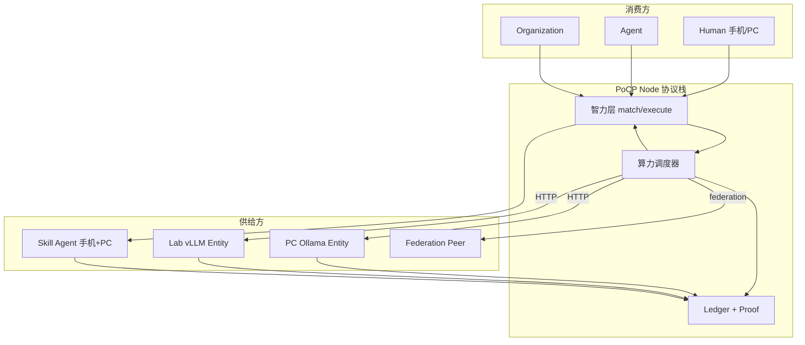

# 神经互联网 — 算力·智力供需与协议设计 v0.3

**Summary.** Full canonical design: **[NEURAL-INTERNET-MASTER-PLAN.md](./NEURAL-INTERNET-MASTER-PLAN.md)** (v1.0). Ops playbooks: [DEPLOYMENT-TOPOLOGY-GUIDE.md](./DEPLOYMENT-TOPOLOGY-GUIDE.md) · [PILOT-NEURAL-INTERNET-HANDBOOK.md](./PILOT-NEURAL-INTERNET-HANDBOOK.md).

Distributed neural internet: who supplies compute & intelligence, who consumes, how the protocol connects and trades.

See also: [CONTRIBUTION-NEURAL-NETWORK.md](./CONTRIBUTION-NEURAL-NETWORK.md) · [DISTRIBUTED-LAYERS.md](./DISTRIBUTED-LAYERS.md) · [ENTITY-MARKET-SPEC.md](./ENTITY-MARKET-SPEC.md) · [COMPUTE-METERING-SPEC.md](./COMPUTE-METERING-SPEC.md) · [COMPUTE-BALANCE-SPEC.md](./COMPUTE-BALANCE-SPEC.md) · [ENTITY-ONTOLOGY.md](./ENTITY-ONTOLOGY.md)

---

## 1. 设计目标

```text
不是：一个平台卖 GPU + 卖 Token
而是：许多 Entity 卖算力与智力，许多 Entity 用 PoCP Token 买，
      协议记住每一次协作（Receipt → Proof → Ledger）
```

**神经互联网** = 贡献神经网络 + 分布式算力层 + 分布式智力层 + **统一 PoCP Token 市场**。

---

## 2. 供给方（Provider）

### 2.1 算力供给方 — 「执行层神经元」

| Entity 类型 | 卖什么 | capability | 典型设备 | 挂牌方式 |
|-------------|--------|------------|----------|----------|
| **LLM** | 文本推理、见证推理 | `llm_inference`, `witness` | PC + Ollama/vLLM | `compute_profile` |
| **Tool** | 嵌入、MCP 宿主 | `embeddings`, `mcp_host` | PC / 服务器 | `compute_profile` |
| **Organization** | 实验室 GPU 池 | 以上组合 | 机房 / 多机 | Org `compute_profile` + ComputePool |
| **Community** | 联邦 peer 见证 | `witness`, peer routes | 节点服务器 | `trusted_nodes` + federation |

**不算「本机重算力」但可参与供给：**

| 形态 | 说明 |
|------|------|
| 手机 + 家里 PC | 算力在 PC，手机管理 heartbeat / Skill 触发 |
| 预计算 Artifact | 闲置 GPU 跑 embedding/缓存，高峰 `cache_hit` 仍算供给 |
| 外部云 adapter | Org treasury 买云 API（最后一档 escalation，非理想主路径） |

### 2.2 智力供给方 — 「编排层神经元」

| Entity 类型 | 卖什么 | 计量 | Receipt |
|-------------|--------|------|---------|
| **Skill** | 专项能力（整理、验证、生成流程） | PoCP Token + 可选等价 LLM tokens | `InvocationTrace` + 可附 `IntelReceipt` |
| **Agent** | 任务编排、多步协作 | 编排步 + 下游算力分成 | `InvocationTrace` |
| **LLM** | 见证 quorum 席位 | 固定 PoCP Token（intel 价） | `ComputeReceipt` + `IntelReceipt` |
| **Human** | 终审、审稿、意义锚点 | CP + 声誉为主；可选 review Token | Review / finalization 进 Ledger |
| **Workflow** | 多 Entity 拓扑模板 | 按链长 | Trace 步骤 |
| **Dataset** | 知识/向量索引（降算力需求） | Artifact 命中 | `ComputeArtifact` |

**手机主路径：** Human + Skill/Agent（卖智力），算力挂靠 PC 或 Org LLM Entity。

---

## 3. 消费方（Consumer）

| Entity 类型 | 买什么 | 典型场景 | Token 来源 |
|-------------|--------|----------|------------|
| **Human** | Skill 执行、Chat、贡献 verify | 学习、志愿、开源 | 注册赠送 + 贡献验证 |
| **Agent** | LLM 推理、Tool、witness | 自动化任务 | Owner Wallet |
| **Organization** | 批量算力、witness quorum | 课程、Pilot、研究 | Sponsor 池 + ComputePool |
| **Skill / Workflow** | 下游 LLM、embeddings | 执行链中继 | 发起者 Wallet 或 Pool 代付 |

**消费约束（协议强制）：**

```text
每次 compute job 必须绑定 contribution_id 或 task_id
→ 无匿名 burn，无 Sybil 空转
```

---

## 4. 基础设施角色（非买卖主体，但联通市场）

| 角色 | 职责 |
|------|------|
| **PoCP Node** | 跑协议栈：调度、Ledger、Proof API（不拥有用户 GPU） |
| **Sponsor / Org ComputePool** | 储备 PoCP Token、低谷 precompute、高峰 burst |
| **Federation peer** | 跨校/跨节点镜像 provider、同步 Proof |
| **Registry** | Entity 发现、Agent Card、compute provider 目录 |

---

## 5. 协议栈 — 三层 + 交易层

```text
┌─────────────────────────────────────────────────────────────┐
│ 交易层（薄）— Wallet · PoCP Token · ComputePool · 限额      │
├─────────────────────────────────────────────────────────────┤
│ 协议层 — Entity · Contribution · Proof · InvocationTrace     │
│          · Ledger · Finalization · Federation                │
├─────────────────────────────────────────────────────────────┤
│ 分布式智力层 — match · orchestrate · verify · graph        │
├─────────────────────────────────────────────────────────────┤
│ 分布式算力层 — ComputeProfile · scheduler · executor         │
│          · Artifact · surplus recycle                      │
└─────────────────────────────────────────────────────────────┘
```

**口诀：** 算力执行 → 智力编排 → 协议记住 → Token 结算。

### 5.1 核心协议对象

| 对象 | 作用 |
|------|------|
| `Entity` | 神经元身份（9 类型） |
| `Contribution Event` | 激活信号（必须绑定交易上下文） |
| `ComputeProfile` | 算力供给挂牌 |
| `ComputeJob` | 调度单元 |
| `ComputeReceipt` | 算力交易凭证 |
| `IntelReceipt` | 智力交易凭证 |
| `InvocationTrace` | 协作链（前向传播） |
| `Wallet` | PoCP Token 余额 |
| `Ledger` | 不可篡改记忆 |

---

## 6. 联通方式（四种）

### 6.1 Entity 挂牌 — 主路径

```text
Provider 注册 compute_profile
  · offers: capability + adapters + models
  · endpoints.base_url: HTTP 可达的 Ollama/vLLM/OpenAI-compatible
  · policy: visibility (org_only | trusted_federation | public_vouched)
  · capacity: max_concurrent

API:
  POST /api/v1/compute/entities/{id}/register
  POST /api/v1/compute/entities/{id}/heartbeat
  GET  /api/v1/compute/providers?mesh_filter=true
```

**联通本质：** PoCP 调度器 → HTTP → Provider 的 `base_url`（不是平台托管 GPU）。

### 6.2 节点本地 — local-first

```text
config/compute_nodes.yaml
  · 本 PoCP 进程所在机器的 mock/ollama/vllm
  · 调度优先级：local_node → Entity → peer
```

适合：后端与 Ollama 在同一台 PC。

### 6.3 组织 Mesh — org_only

```text
compute_mesh.py
  · 同 Organization Entity 下的 provider 互相可见
  · 消费者 initiator 与 provider 同 org 才可调度
```

适合：Rain 实验室、学校、企业内网。

### 6.4 联邦 + LAN — 跨节点

```text
trusted_nodes.yaml + federation
  · GET /compute/providers/federation
  · peer POST /intelligence/compute/inference|witness
  · GET /compute/discovery/lan（advisory）
```

适合：多校区、多 Operator PoCP 节点互联。

### 6.5 联通拓扑图



---

## 7. 交易方式 — 统一 PoCP Token

### 7.1 一种 Token

```text
LLM 用量（Receipt.usage）→ 折算 → PoCP Token（Wallet.ai_credits）
智力服务 → 表定价 → PoCP Token
同一种 Token：计量、结算、储备、买卖
```

配置：`pocp_rewards.yaml` → `compute_metering.unified_token: true`

### 7.2 一笔交易的协议步骤

```text
1. 绑定    contribution_id | task_id
2. 调度    schedule_compute_job → 选 provider（mesh/声誉/价格）
3. 执行    executor HTTP 调 provider 或 cache_hit Artifact
4. 计量    usage.llm_* + settlement.pocp_tokens_*
5. 扣款    消费者 Wallet −= pocp_tokens_consumer
6. 入账    提供者 Wallet += pocp_tokens_provider（可多方 split）
7. 凭证    ComputeReceipt / IntelReceipt（receipt_hash）
8. 记忆    Ledger + InvocationTrace + Proof compute_attribution
9. 声誉    compute_provider / skill / agent reputation +=
```

### 7.3 多方分账（一次 Skill 执行）

```text
Human（消费者）     −= 10 PoCP Token
  ├─ Skill Entity   += 1   （智力 orchestration）
  ├─ LLM Entity     += 7   （算力）
  └─ Witness Entity += 2   （智力 witness）
```

### 7.4 动态平衡机制

| 状态 | 协议动作 |
|------|----------|
| 算力过剩 | `POST /compute/surplus/recycle` → Artifact；Org Pool 沉淀 |
| 算力不足 | 调度 escalation → 远程 Entity → federation → 外部 adapter |
| Pool 低 | Sponsor `POST /compute/pools/{org}/deposit` |

见 [COMPUTE-BALANCE-SPEC.md](./COMPUTE-BALANCE-SPEC.md)。

### 7.5 交易 vs 贡献奖励

| 类型 | 触发 | Token |
|------|------|-------|
| **市场交易** | compute/intel job + Receipt | 消费者扣、提供者加 |
| **贡献奖励** | Contribution 验证通过 | 协议 mint 进 Wallet（非对手方） |
| **CP** | 同上 | 不可 spend，仅证明 |

---

## 8. 典型端到端场景

### 8.1 宿舍 PC 卖算力 + 手机卖智力

```text
[供给]
  手机：Human + Skill Entity「移动学习助手」
  PC：LLM Entity + compute_profile(Ollama)

[消费]
  同学：Human，执行 Skill，绑 contribution_id

[联通]
  智力层路由 Skill → 调度 PC llm_inference → HTTP 127.0.0.1:11434

[交易]
  同学 Wallet −PoCP Token
  Skill Entity +PoCP Token
  PC LLM Entity +PoCP Token
  Receipt → Proof 可导出
```

### 8.2 组织赞助池

```text
Org 注入 ComputePool
  → 学生贡献任务免费/低价跑 witness
  → 实验室 GPU 低谷 precompute Artifact
  → 高峰 burst 仍在本 Org mesh 内
```

---

## 9. 与中心化平台对比

| | 中心化 API | PoCP 神经互联网 |
|--|------------|-----------------|
| 算力谁卖 | 一家 | 多 Entity（PC/Org/peer） |
| 智力谁卖 | bundled 在 API | Skill/Agent/Human 分开定价 |
| Token 谁发 | 平台 | 贡献 mint + 双边交易流转 |
| 联通 | 单一 endpoint | Profile + mesh + federation |
| 审计 | 账单 | Receipt → Proof Packet |
| 手机 | 只能用 App | 卖智力；算力挂靠 PC/Org |

---

## 10. API 速查（Pilot）

| 目的 | API |
|------|-----|
| 挂牌算力 | `POST /compute/entities/{id}/register` |
| 保持在线 | `POST /compute/entities/{id}/heartbeat` |
| 发现 provider | `GET /compute/providers` |
| 调度 job | `POST /compute/jobs` |
| 执行 Skill | `POST /api/v1/capabilities/execute`（内部走 scheduler） |
| 看余额 | `GET /api/v1/me` |
| 供需诊断 | `GET /compute/balance/summary` |
| 回收闲置算力 | `POST /compute/surplus/recycle` |
| Org 池充值 | `POST /compute/pools/{org_id}/deposit` |
| 导出 Proof | Contribution Proof Packet API |

---

## 11. 实现映射（当前代码）

| 设计 | 代码 |
|------|------|
| 算力挂牌 | `services/compute_profile.py` |
| 调度 | `services/compute_scheduler.py` |
| 执行 | `services/compute_executor.py` |
| 计量/结算 | `services/compute_metering.py`, `compute_settlement.py` |
| 智力执行 | `services/capability_execute.py`, `intelligence/engines.py` |
| Mesh | `services/compute_mesh.py` |
| 联邦 | `services/compute_federation.py`, `peer_compute.py` |
| 池/平衡 | `services/compute_pool.py`, `compute_precompute.py` |
| Proof | `services/proof.py`, `compute_attribution.py` |

---

## 12. 演进路线

| 阶段 | 供给/消费/联通/交易 |
|------|---------------------|
| **α–δ** ✅ | ComputeProfile、scheduler、Receipt、mesh、federation |
| **v0.2** ✅ | 统一 PoCP Token、Artifact、IntelReceipt |
| **v0.3** ✅ | ComputePool、surplus recycle、balance API |
| **v0.4** ✅ | 自动 precompute cron（`compute_balance_cron.py`） |
| **v0.4** | federation 跨节点 Token 清算；Skill 多方 split UI |
| **v1.0** | 移动端 Agent 宿主；可选 Protocol Token 治理 |

---

## 13. 一句话

> **供给方：LLM/Tool/Org 卖算力，Skill/Agent/Human 卖智力；消费方：Human/Agent/Org 用 PoCP Token 买；联通：HTTP Profile + mesh + 联邦；交易：Receipt 证明，Wallet 同一 Token 扣加，Ledger 记住。**
