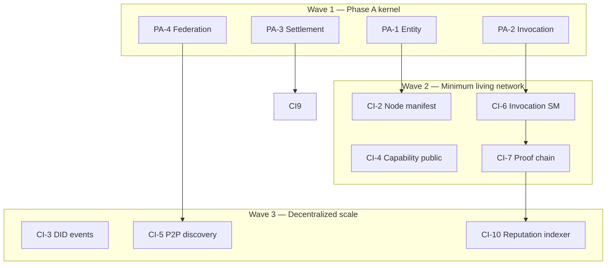

# Capability Internet — Agent Studio Backlog

**Mission plan id:** `capability_internet`  
**Spawn:** `POST /api/v1/agent-studio/missions/from-plan/capability_internet`

Canonical vision: [CAPABILITY-INTERNET-PROTOCOL.md](../CAPABILITY-INTERNET-PROTOCOL.md) · Layer map: [POCP-NETWORK-ARCHITECTURE.md](../POCP-NETWORK-ARCHITECTURE.md)

Depends on Phase A kernel ([PHASE-A-KERNEL-BACKLOG.md](./PHASE-A-KERNEL-BACKLOG.md)) for entity catalog + acceptance green.

---

## CI track (12 layers → issues)

| CI | Layer | Issue title | Owner | Phase | Depends |
|----|-------|-------------|-------|-------|---------|
| CI-1 | Entity | Entity layer complete — 14 types, ownership, ontology API | Atlas-0 | A | PA-1 |
| CI-2 | Node | NodeProfile model + heartbeat + well-known manifest | Atlas-0, Grid-0 | A→B | CI-1 |
| CI-3 | Identity | Signed protocol events + federation DID roadmap | Atlas-0, Vault-0 | B | CI-2 |
| CI-4 | Capability | Public capability registry + execute receipts | Pulse-0 | A | PA-1 |
| CI-5 | Discovery | Rule router → capability search + peer manifest | Pulse-0, Mesh-0 | A→B | CI-4 |
| CI-6 | Invocation | Full invocation state machine + cross-node refs | Pulse-0, Vault-0 | A | PA-2 |
| CI-7 | Proof | Proof packet binds invocation chain + export | Vault-0 | A | CI-6 |
| CI-8 | Verification | Verifier network + challenge/appeal (PR-B) | Forge-0 | A | PA-3 |
| CI-9 | Settlement | Multi-party settlement + policy replay | Prism-0, Vault-0 | A | PA-3 |
| CI-10 | Reputation | Event-sourced reputation graph indexer | Sentinel-0 | B | PA-6 |
| CI-11 | Governance | PIP template + weighted vote scaffold | Lex-0, Atlas-0 | B | CI-10 |
| CI-12 | Economy | CP/AIC/CC metering docs + no public token guard | Prism-0, Lex-0 | A | CI-9 |

---

## Wave sequencing



---

## Acceptance gates

| Gate | Command / signal |
|------|------------------|
| Entity layer | `python backend/scripts/audit_entities.py --repair` → Complete |
| Minimum living | [MINIMUM-LIVING-NETWORK.md](../MINIMUM-LIVING-NETWORK.md) checklist |
| Federation | `run_phase_a_acceptance.py :8100 --federation :8101` |
| Public node (B) | `GET /.well-known/pocp-node.json` on skill template |
| No token-first | Lex-0 README/UI review |

---

## Repo split (future — do not block Phase A)

When CI-1..CI-9 stable in `pocp-ai-commons`, extract:

```text
pocp-protocol-spec     ← normative MD from docs/protocol + architecture
pocp-node              ← PUBLIC-NODE-PROTOCOL handlers
pocp-skill-node-template
pocp-verifier-node
```

Until then, **all implementation stays in this monorepo** under `backend/services/{capability,invocation,proof,...}`.

---

## Cursor automation

Host worker (Python 3.12):

```powershell
py -3.12 -m pip install cursor-sdk
.\scripts\run-studio-super-loop.ps1
```

Handoffs in plan `capability_internet` dispatch Atlas → Pulse → Vault → Forge → Mesh → Gauge per layer.
