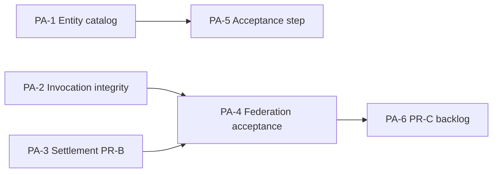

# Phase A Kernel Backlog — Agent Studio dispatch

**North star:** Local hardening before public staging — all 14 Entity types registered, capability registry seeded, protocol integrity + settlement policy green, federation acceptance PASS on `:8100`/`:8101`.

**Mission plan id:** `phase_a_kernel`  
**Spawn:** `POST /api/v1/agent-studio/missions/from-plan/phase_a_kernel`  
**CLI:** `python backend/scripts/spawn_kernel_mission.py`

---

## Issue ↔ PA mapping

| Issue | PA | Title | Owner Meta Agent | Status |
|-------|-----|-------|------------------|--------|
| [PA-01](issues/PA-01-entity-catalog.md) | PA-1 | Entity catalog — 14 types + capability registry | Atlas-0, Pulse-0 | **In progress** (WIP uncommitted) |
| [PA-02](issues/PA-02-invocation-integrity.md) | PA-2 | Invocation ref integrity (PR-A) | Vault-0 | **Done** — verify federation acceptance |
| [PA-03](issues/PA-03-settlement-challenge.md) | PA-3 | Settlement policy + challenge/appeal (PR-B) | Forge-0, Prism-0 | **Implemented** — commit + tests |
| [PA-04](issues/PA-04-federation-acceptance.md) | PA-4 | Federation acceptance full green | Mesh-0, Gauge-0 | **Blocked** — restart `:8100` backends |
| [PA-05](issues/PA-05-entity-acceptance-step.md) | PA-5 | Entity catalog acceptance step | Gauge-0, Pulse-0 | **Todo** |
| [PA-06](issues/PA-06-reputation-mcp-security.md) | PA-6 | Reputation event-sourcing + MCP security (PR-C) | Sentinel-0, Atlas-0 | **Backlog** |

**Deferred (not in this mission):** Public staging deploy, Wallet/Settlement Wave 2 public push.

---

## Dependencies



---

## Acceptance gate (mission complete)

```powershell
# Entity catalog
python backend/scripts/audit_entities.py --repair
# Expect: Complete: True, 14 ontology types, capabilities >= 11

# Full suite
cd backend && python -m pytest -q

# Federation (NOT :8008 — use federation stack)
docker compose -f docker-compose.federation.yml restart backend-a backend-b
python backend/scripts/run_phase_a_acceptance.py http://127.0.0.1:8100 --federation http://127.0.0.1:8101
```

---

## Agent Studio handoff chain

See `backend/services/agent_studio/mission_plans.py` → `PHASE_A_KERNEL_PLAN`.

Nexus-0 dispatches in order: Atlas → Pulse → Vault → Forge/Prism → Mesh → Gauge → Herald → (optional Sentinel scaffold).

---

## Related docs

- [ROADMAP-THREE-PHASES.md](../ROADMAP-THREE-PHASES.md)
- [ENTITY-ONTOLOGY.md](../ENTITY-ONTOLOGY.md) (if present)
- `backend/services/entity_catalog.py`
- `backend/scripts/audit_entities.py`
