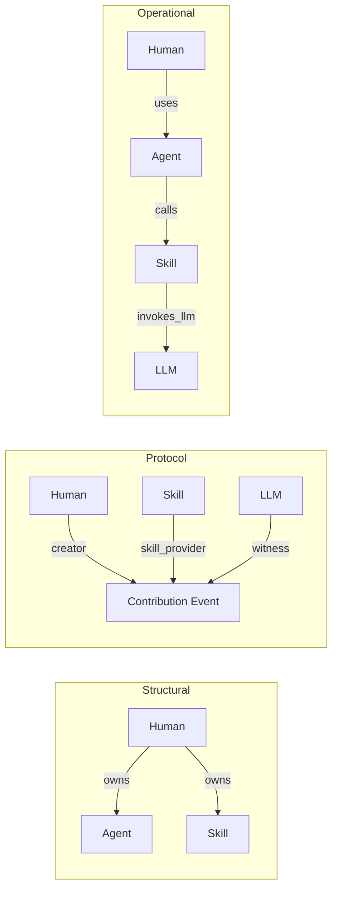

# Entity Connection Protocol v0.1

**Principle:** *Everything connects through verified contribution.*  
**中文：** *万物都有贡献，万物互联于贡献协议。*

This document defines **how Entity types connect** in PoCP — not arbitrary IoT links, but three protocol layers that every integration must use.

Related: [ENTITY-ONTOLOGY.md](../ENTITY-ONTOLOGY.md) · [ENTITY-SCHEMA-v0.3.md](./ENTITY-SCHEMA-v0.3.md) · [ENTITY-DIALOGUE-PROTOCOL.md](./ENTITY-DIALOGUE-PROTOCOL.md) · [CAPABILITY-SCHEMA-v0.3.md](./CAPABILITY-SCHEMA-v0.3.md) · [TRUST-POLICY-BUNDLE.md](./TRUST-POLICY-BUNDLE.md)

---

## 1. Three connection layers

| Layer | ID | Relations | Source | Meaning |
|-------|-----|-----------|--------|---------|
| **Structural** | `structural` | `owns`, `created`, `founded`, `sponsors` | `Entity.owner_id` / `creator_id` | Accountability — who maintains and is responsible |
| **Contribution protocol** | `protocol` | `submits`, `witnesses`, `verifies`, `reviews`, `sponsors`, `provides_tool`, `provides_data` | `ContributionParticipant` (role + weight) | Verified value — entities connect by co-signing contribution proofs |
| **Operational trace** | `operational` | `uses`, `calls`, `invokes_llm`, `invokes_mcp`, `hosts_inference` | `InvocationTrace` / `InvocationStep` (+ `capability_receipt` in step metadata) | Runtime chains — Human→Agent→Skill→Tool→LLM with portable receipts |



**Rule:** A new integration is valid when it can be expressed in at least one layer with evidence and (where applicable) a finalization path.

---

## 2. Per-type connection profiles

Each `entity_type` has a **connection spec** — what it may own, invoke, and play in events.

| Type | Can own | Typical invoke targets | Typical roles |
|------|---------|------------------------|---------------|
| `human` | agent, skill, tool, dataset, workflow, compute_node, verifier_node, reviewer_node, organization | agent, skill, tool, workflow | creator, reviewer, coordinator |
| `agent` | — | skill, tool, llm, workflow | executor, coordinator, reviewer |
| `skill` | — | llm, tool | skill_provider |
| `llm` | — | — | model_provider, witness, verifier, reviewer |
| `tool` | — | tool (MCP), llm | tool_provider |
| `dataset` | — | — | data_provider |
| `workflow` | — | agent, skill, tool | coordinator |
| `organization` | agent, skill, tool, dataset, workflow, compute_node | agent, workflow | sponsor, coordinator |
| `community` | — | — | sponsor, witness |
| `compute_node` | — | llm | model_provider, tool_provider |
| `verifier_node` | — | llm | verifier, witness |
| `reviewer_node` | — | — | reviewer |
| `sponsor` | organization | — | sponsor |
| `protocol_treasury` | — | — | sponsor |

Non-human types **require** an `owner_id` pointing to a human or organization (accountability anchor).

---

## 3. Invocation edge matrix

Operational layer uses typed `(source_type, target_type) → action`:

| Source | Target | Action |
|--------|--------|--------|
| human | agent, skill, tool, workflow | `uses` |
| agent | skill | `calls` |
| agent | tool, workflow | `uses` |
| agent | llm | `invokes_llm` |
| skill | llm | `invokes_llm` |
| skill | tool | `calls` |
| tool | tool | `invokes_mcp` |
| tool | llm | `invokes_llm` |
| workflow | agent, skill | `calls` |
| workflow | tool | `uses` |
| compute_node | llm | `hosts_inference` |
| verifier_node | llm | `witnesses` |

Each step may attach a **`pocp.capability_receipt.v0.1`** block in step metadata for federation and proof export.

---

## 4. Example topologies

### Minimal study flow (Pilot)

```
Human (creator)
  └─ uses → Agent (executor)
              └─ calls → Skill (skill_provider)
                           └─ invokes_llm → LLM (model_provider, witness, verifier)
```

Contribution event participants mirror the chain; ledger and proof packet bind all three layers.

### Data-backed report

```
Human → Workflow (coordinator) → Agent → Skill + Tool + Dataset
                                              └─ invokes_llm → LLM (verifier)
Community (sponsor) ──protocol──► Contribution Event
```

---

## 5. API surface

| Endpoint | Purpose |
|----------|---------|
| `GET /api/v1/entities/connections/matrix` | Full type-level matrix (all layers) |
| `GET /api/v1/intelligence/protocol/entity-connections` | Same matrix on intelligence protocol surface |
| `GET /api/v1/entities/{entity_id}/connections` | Instance view — structural + protocol + operational counts and samples |
| `GET /api/v1/entities/ontology` | Ontology doc includes `entity_connections` pointer |

### Instance response shape (summary)

```json
{
  "entity_id": "...",
  "entity_type": "agent",
  "connection_spec": { "...": "..." },
  "allowed": {
    "can_own_types": [],
    "typical_invocation_targets": ["skill", "tool", "llm"],
    "suggested_invocation_actions": { "skill": "calls", "llm": "invokes_llm" }
  },
  "structural": { "owner": {}, "owned": [], "created": [] },
  "protocol": { "participations": [], "roles_seen": [] },
  "operational": { "outbound_steps": [], "inbound_steps": [] }
}
```

---

## 6. Integration checklist

When connecting a new Entity (or external system):

1. **Register** with correct `entity_type` and `owner_id` (structural layer).
2. **Declare** capabilities in metadata (`tool_kind`, `compute_profile`, skill frontmatter, …).
3. **Participate** in at least one Contribution Event with a valid participant role (protocol layer).
4. **Record** runtime via `InvocationTrace` when the entity executes or is invoked (operational layer).
5. **Attach** capability receipts on invocation steps when exporting proofs or federating.

---

## 7. Code references

- Connection specs & matrix: `backend/intelligence/entity_ontology.py`
- Instance builder: `backend/services/entity_connections.py`
- Graph edges: `backend/services/graph.py`
