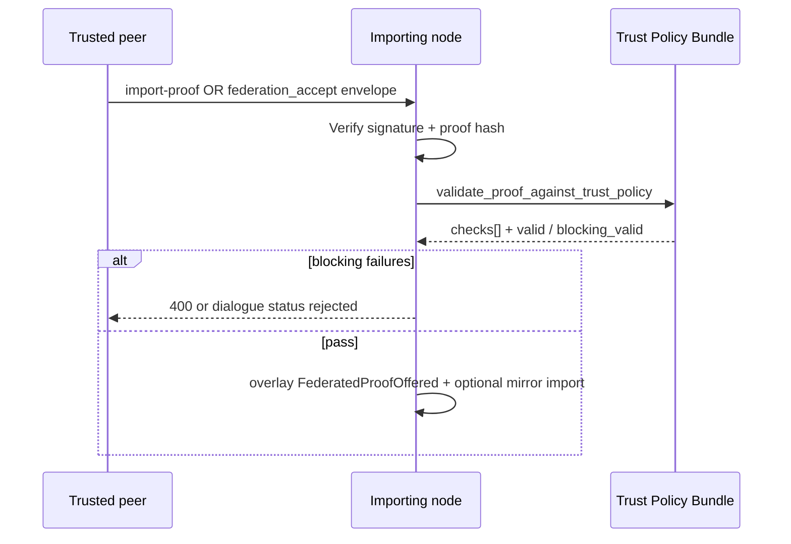

# Trust Policy Bundle v0.1

**Schema:** `pocp.trust_policy_bundle.v0.1`

A **Trust Policy Bundle** is the instance-specific policy pack a PoCP node publishes so federation peers know how to validate imported contribution proofs. It composes:

| Component | Source | Purpose |
|-----------|--------|---------|
| **Federation trust** | `trusted_nodes.yaml` / `POCP_TRUSTED_NODES` | Who may export/import; trust weights |
| **Finalization policy** | `finalization_policy.yaml` | What counts as approved / auto-finalized |
| **Entity connections** | Entity ontology matrix | Invocation edge + participant role rules |
| **Rights rules** | `pocp_rewards.yaml` | Reputation import weighting |
| **Import rules** | `trust_policy_bundle.yaml` | Proof shape + validation strictness |

Related: [ENTITY-CONNECTION.md](./ENTITY-CONNECTION.md) · [ENTITY-DIALOGUE-PROTOCOL.md](./ENTITY-DIALOGUE-PROTOCOL.md) · [CONSTITUTION-v0.1.md](./CONSTITUTION-v0.1.md)

---

## 1. Why a bundle?

PoCP separates **universal protocol kernel** (Entity, Contribution, Proof, Ledger) from **instance policy**. Federation import must answer:

1. Is the source node trusted?
2. Is the proof cryptographically intact?
3. Does the contribution status match our import policy?
4. Do invocation steps and participant roles obey the connection matrix?
5. Does finalization evidence meet our witness quorum rules?

The bundle exposes all of this in one portable JSON document.

---

## 2. Import rules (`trust_policy_bundle.yaml`)

```yaml
import_rules:
  proof_type: pocp_contribution_proof
  allowed_contribution_statuses: [approved]
  require_integrity_proof_hash: true
  require_evidence_content_hash: true
  validate_participant_roles: true
  validate_invocation_edges: true
  enforce_invocation_matrix_strict: false
  require_capability_receipt_on_steps: false
  min_witness_count: 0
```

| Rule | Default | Effect |
|------|---------|--------|
| `validate_invocation_edges` | `true` | Check steps against [ENTITY-CONNECTION](./ENTITY-CONNECTION.md) matrix |
| `enforce_invocation_matrix_strict` | `false` | When `true`, bad edges **block** import; otherwise advisory |
| `require_capability_receipt_on_steps` | `false` | Require `pocp.capability_receipt.v0.1` on each step |
| `min_witness_count` | `0` | Minimum `verification.ai_advisory` rows |

Set `POCP_STRICT_TRUST_POLICY=true` to treat all failed checks as blocking.

Docker overlay (Node B mirror):

```bash
docker compose -f docker-compose.federation.yml -f docker-compose.federation.strict.yml up -d backend-b
python backend/scripts/federation_strict_mode_test.py
```

---

## 3. Validation flow

Applies to REST `POST /federation/import-proof`, `POST /federation/validate-proof`, and dialogue kinds `federation_offer` / `federation_accept` ([ENTITY-DIALOGUE-PROTOCOL.md](./ENTITY-DIALOGUE-PROTOCOL.md) §4.3).



| Entry path | Dialogue kind | Default import |
|------------|---------------|----------------|
| `POST /api/v1/federation/import-proof` | `federation_accept` (binding) | yes |
| `POST /api/v1/federation/validate-proof` | `federation_offer` (validation only) | no |
| `POST /api/v1/intelligence/dialogue` | `federation_offer` / `federation_accept` | offer: no; accept: yes |

Validation results are stored on the import record as `protocol_excerpt.trust_policy_validation`. Dialogue responses echo the same `validation` object in `result`.

---

## 4. API

| Endpoint | Purpose |
|----------|---------|
| `GET /api/v1/federation/trust-policy-bundle` | Full bundle for this node |
| `GET /api/v1/intelligence/protocol/trust-policy-bundle` | Same on protocol surface |
| `POST /api/v1/federation/validate-proof` | Dry-run validation (no import) |
| `GET /api/v1/intelligence/protocol/primitives` | Schemas + embedded bundle |

### Validate-proof request

```json
{
  "source_node_id": "node-a",
  "proof": { "proof_type": "pocp_contribution_proof", "...": "..." }
}
```

### Response (summary)

```json
{
  "schema": "pocp.trust_policy_bundle.v0.1",
  "valid": true,
  "blocking_valid": true,
  "check_count": 8,
  "failed_count": 0,
  "checks": [{ "id": "proof_type", "ok": true, "blocking": true }]
}
```

---

## 5. Integration checklist for new peers

1. Exchange `GET /federation/trust-policy-bundle` — compare `bundle_fingerprint`.
2. Align `trusted_nodes` on both sides (public keys + trust weights).
3. Dry-run proofs via `POST /federation/validate-proof` before enabling sync.
4. Enable `POCP_STRICT_TRUST_POLICY` in production after Pilot green.

---

## 6. Code references

- Bundle loader + validator: `backend/services/trust_policy_bundle.py`
- Import hook: `backend/services/federation_import.py`
- Config: `backend/config/trust_policy_bundle.yaml`
